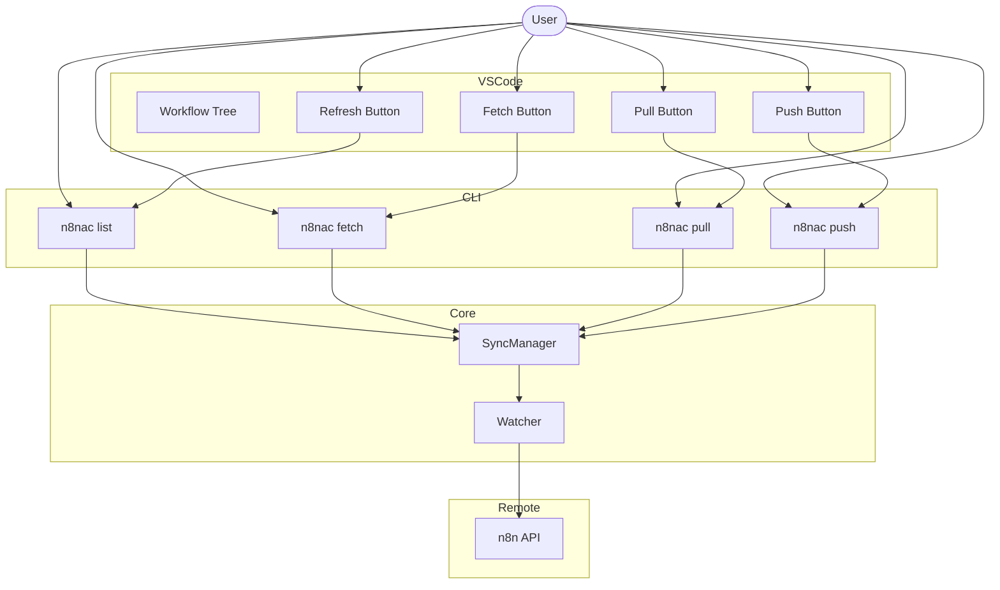

# Refactoring Plan: Git-like Sync Completion

This plan outlines the steps to complete the refactoring of the `n8n-as-code` project to a clean git-like synchronization model, ensuring that the CLI and VSCode extension are harmonized and legacy code is removed.

## 1. CLI Refactoring

### 1.1 Command Harmonization
- Ensure `pull`, `push`, and `fetch` all use `<workflowId>` as the primary identifier and cannot be used to operate on "all" workflows at once.
- Verify `list` supports `--local`, `--remote` (alias `--distant`) and that list without flags shows combined view with clear local_only/remote_only/both status indicators.
- Ensure `list` is ultra lightweight: metadata only, no TS compilation, no deep diffs and should be able to list hundreds of workflows in under a second.

### 1.2 Deprecation cleanup
- Remove any remaining "auto-sync" or "sync status" (global) terminology in help texts.

## 2. Core Library Refactoring

### 2.1 SyncManager Cleanup
- Remove `handleLocalFileChange` (deprecated by Git-like model).
- Rename `getWorkflowsLightweight` to `listWorkflows` for better naming alignment.
- Rename `getWorkflowStatus` to `getSingleWorkflowDetailedStatus` or similar to distinguish from lightweight list.
- Ensure `Watcher` doesn't emit unnecessary logs during initial scan that might confuse users about change detection.

### 2.2 Watcher Fixes
- Investigate the `[n8n] Change detected: EXIST_ONLY_REMOTELY` log during initialization.
- at startup we should do a simple adn fast list.

## 3. VSCode Extension Refactoring

### 3.1 Command Implementation Shift
- Shift command handlers (`n8n.pullWorkflow`, `n8n.pushWorkflow`, `n8n.fetchWorkflow`) to call the internal CLI API commands instead of direct `SyncManager` methods where possible, or ensure they use the high-level methods that mirror CLI behavior.
- Shift tree view population to rely on the new `list` command for accurate status representation.
- Shift the refresh button to trigger the `list` command instead of any previous "sync status" logic.
- Shift all git-like sync logic to use high level CLI commands to ensure consistency and reduce code duplication.
- The goal is to avoid code duplication between CLI and Extension. The extension should be a thin layer that calls the CLI commands and renders the results, rather than implementing its own sync logic.

### 3.2 UI Updates
- **Refresh Button:** Ensure the global refresh button in the tree view calls the `list` command (via `SyncManager.getWorkflowsLightweight`).
- **Fetch Button:** Ensure the per-workflow fetch button is correctly wired to the `fetch <workflowId>` logic.

### 3.3 Enhanced Tree Provider
- Ensure it properly displays "local-only", "remote-only", and "both" workflows based on the lightweight list.

## 4. Documentation

- Update all `README.md` files (root, cli, extension) to reflect the final command set and git-like paradigm.

## 5. Mermaid Diagram of New Workflow

